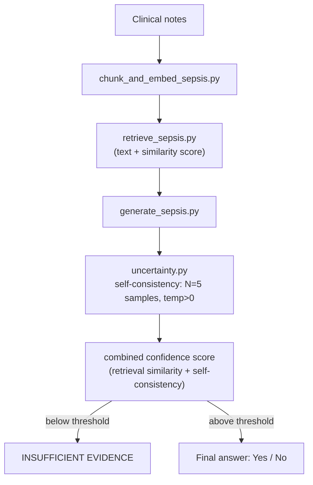
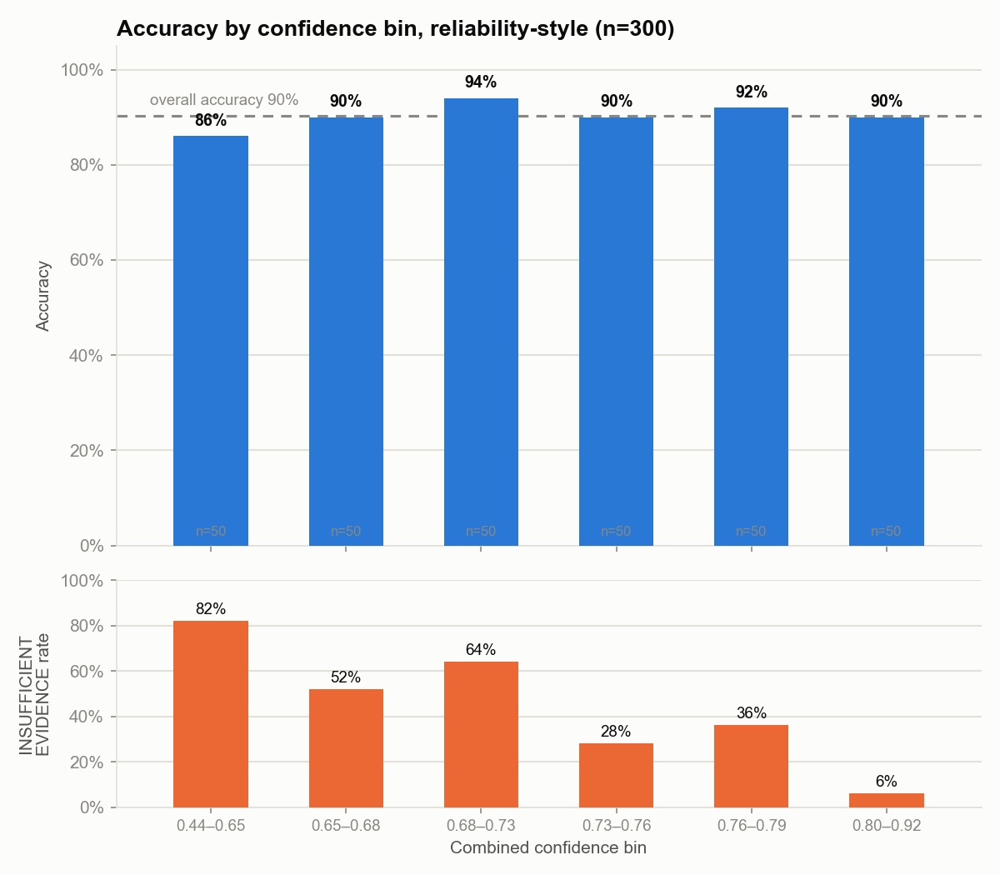

# MedGrounded: Uncertainty-Aware RAG for SEP-1 Sepsis Bundle Compliance

## Purpose

MedGrounded started as a faithfulness benchmark for biomedical RAG (Retrieval-Augmented Generation): given a question and retrieved context, is the generated answer actually supported by that context, or does it subtly misrepresent, exaggerate, or distort the source?

This branch asks a companion question: grounding is necessary but not sufficient. A faithful-sounding answer can still be wrong if the retrieved evidence is thin or the model itself is inconsistent across samples. So instead of only scoring an answer *after* it's generated, this project adds a layer that decides, *before* committing to an answer, whether the system is confident enough to answer at all.

The target task is **SEP-1** ("Severe Sepsis/Septic Shock Early Management Bundle") **compliance checking from clinical notes**, for example "were antibiotics given within 3 hours?", across 5 core bundle elements. The uncertainty layer is inspired by [COMPOSER (Boussina et al., *npj Digital Medicine*, 2024)](https://doi.org/10.1038/s41746-023-00986-6), which uses conformal prediction so a sepsis prediction model can flag a case as **indeterminate** instead of forcing a low-confidence guess, cutting false alarms by ~75% versus its predecessor. This project does not implement conformal prediction itself (that needs a formal calibration set this project doesn't have); it borrows the same "know when you don't know" philosophy and applies it to a RAG question-answering setting: a confidence score combining **retrieval similarity** and **self-consistency across repeated LLM samples**, which gates low-confidence answers to an explicit `INSUFFICIENT EVIDENCE` rather than letting the system guess.

## Architecture



```
MedGrounded/
├── data/
│   ├── raw/
│   │   ├── sepsis_notes_synthetic.jsonl         # Synthetic SEP-1 notes (gitignored, regenerate locally)
│   │   └── sepsis_ground_truth_synthetic.jsonl  # Ground truth for the notes (gitignored, regenerate locally)
│   └── processed/
│       ├── sepsis_chunks.jsonl                              # Chunked notes
│       ├── sepsis_embeddings.npy, sepsis_faiss_index/       # Cosine FAISS index (gitignored, regenerate locally)
│       └── sepsis_eval_results.jsonl, sepsis_eval_summary.jsonl  # SEP-1 accuracy by confidence
├── src/
│   ├── retrieval/
│   │   ├── generate_sepsis_notes.py    # Synthetic SEP-1 notes + ground truth generator
│   │   ├── chunk_and_embed_sepsis.py   # Chunk + embed notes, cosine FAISS index
│   │   └── retrieve_sepsis.py          # Per-patient scoped retrieval + similarity score
│   ├── generation/
│   │   └── generate_sepsis.py    # SEP-1 question answering, structured JSON output
│   └── eval/
│       ├── uncertainty.py        # Core of this project, see below
│       └── evaluate_sepsis.py    # Full pipeline + accuracy-by-confidence
├── .env                      # API keys (not committed)
├── .env.example               # Template of required environment variables
└── requirements.txt
```

- **`data/`**: `raw/` holds the synthetic SEP-1 notes, gitignored since they're procedurally generated fake data and not something to track (regenerate locally via `generate_sepsis_notes.py`). `processed/` holds everything the pipeline generates from them.
- **`src/retrieval/`**: `generate_sepsis_notes.py` procedurally generates the fake notes; `chunk_and_embed_sepsis.py` chunks and embeds them into a cosine-similarity FAISS index (`IndexFlatIP` over L2-normalized embeddings); `retrieve_sepsis.py` searches that index, scoped to one patient's own notes at a time, returning text plus a similarity score in `[0, 1]`.
- **`src/generation/generate_sepsis.py`**: answers each of the 5 SEP-1 bundle questions from retrieved context only, never guessing; it answers `INSUFFICIENT EVIDENCE` when the context doesn't support a confident answer. Returns structured `{"answer": ..., "justification": ...}` JSON, with temperature applied per call (needed for self-consistency below).
- **`src/eval/uncertainty.py`** (**the core of this project**): combines retrieval confidence (top similarity score) with self-consistency (agreement rate across 5 repeated, temperature>0 samples of the same question) into one confidence score, and force-overrides the final answer to `INSUFFICIENT EVIDENCE` when that score falls below a threshold, regardless of what generation produced.
- **`src/eval/evaluate_sepsis.py`**: runs the full pipeline over every (patient, SEP-1 question) pair, scores against ground truth, and buckets results by confidence to check whether confidence tracks accuracy.

## Environment setup

### Option A: Docker (recommended for quick testing, no local Python setup needed)

```bash
# 1. Build the image
docker build -t medgrounded:v1 .

# 2. Create .env from the template and fill in your API key
cp .env.example .env

# 3. Run the container, mounting data/ and .env
docker run -it --env-file .env -v "$(pwd)/data:/app/data" medgrounded:v1
```

### Option B: venv (recommended if you want to modify the code)

```bash
# 1. Create a virtual environment
python -m venv venv
source venv/bin/activate      # macOS/Linux

# 2. Install dependencies
pip install -r requirements.txt

# 3. Create .env from the template and fill in your API key
cp .env.example .env
```

In `.env`, the required variable is:

```
ANTHROPIC_API_KEY=sk-ant-...
```

(`OPENAI_API_KEY`, `VECTOR_DB_URL`, etc. in `.env.example` are not used by the current pipeline and can be left blank.)

## How to run (in order)

All commands run from the `MedGrounded/` root with the venv activated.

### Step 1: Generate synthetic SEP-1 notes + ground truth

```bash
python src/retrieval/generate_sepsis_notes.py
```

Procedurally generates 60 fake clinical notes (**not** real patient data, see [Technical challenges](#technical-challenges) for why) across 5 clinician-voice archetypes and varying documentation completeness, to `data/raw/sepsis_notes_synthetic.jsonl`, plus ground truth answers for all 5 SEP-1 questions per note to `data/raw/sepsis_ground_truth_synthetic.jsonl`. Both output files are gitignored; this step must be run locally before the rest of the pipeline works.

### Step 2: Chunk, embed, and build index

```bash
python src/retrieval/chunk_and_embed_sepsis.py
```

Chunks each note (~500 chars, 50-char overlap), embeds with `all-MiniLM-L6-v2`, and builds a cosine-similarity FAISS index (`IndexFlatIP` over L2-normalized embeddings) so retrieval returns a similarity score in `[0, 1]`. Output: `data/processed/sepsis_chunks.jsonl`, `sepsis_embeddings.npy`, `sepsis_faiss_index/index.faiss`.

### Step 3: Sanity-check retrieval (optional)

```bash
python src/retrieval/retrieve_sepsis.py
```

Runs `retrieve_sepsis()` for one patient and prints the top matching chunks with similarity scores.

### Step 4: Sanity-check generation (optional)

```bash
python src/generation/generate_sepsis.py
```

Runs `generate_sepsis_answer()` against a fabricated context and prints the structured `{"answer", "justification"}` result.

### Step 5: Evaluate the full pipeline (confidence-bucketed accuracy)

```bash
python src/eval/evaluate_sepsis.py
```

For every (patient, SEP-1 question) pair: retrieves context, runs 5-sample self-consistency generation, computes the combined confidence score, applies the low-confidence gate, and compares the final answer to ground truth. Prints an accuracy table by confidence level. Output: `data/processed/sepsis_eval_results.jsonl` (detailed) and `sepsis_eval_summary.jsonl` (summary).

## Results

Run on 60 synthetic notes × 5 SEP-1 questions = 300 question-answer pairs, each answered with 5-sample self-consistency (1,500 generation calls), plus 35 targeted re-calls to recover pre-gate answers for the opportunity-cost analysis below (1,535 total generation calls).

> **Demo/placeholder results.** The synthetic notes only exist to exercise the pipeline's logic end-to-end; these numbers are not clinically meaningful. Real accuracy/coverage numbers will replace this table once MIMIC-IV-Note credentialed access is approved (see [Technical challenges](#technical-challenges)).

Split into 6 equal-sized bins by the combined confidence score (rather than fixed Low/Medium/High cutoffs, which don't hold up well against this scale's actual score distribution):

| Confidence bin | Accuracy | INSUFFICIENT EVIDENCE rate |
|---|---|---|
| 0.441 – 0.647 | 86.00% | **82.00%** |
| 0.648 – 0.684 | 90.00% | 52.00% |
| 0.685 – 0.733 | 94.00% | 64.00% |
| 0.733 – 0.762 | 90.00% | 28.00% |
| 0.763 – 0.791 | 92.00% | 36.00% |
| 0.796 – 0.918 | 90.00% | **6.00%** |
| **Overall (n=300)** | **90.33%** | n/a |



Accuracy stays in a narrow 86-94% band across the whole confidence range: the system is already fairly accurate overall, so there isn't much room for accuracy itself to climb further. The clearer signal is the **INSUFFICIENT EVIDENCE rate**, which drops from 82% in the lowest confidence bin to 6% in the highest. The system defers far more often exactly where it's least sure of the underlying evidence, which is the core "know when you don't know" behavior this project is built to demonstrate.

One notable finding while validating this at 60-note scale: **self-consistency is nearly saturated**. 292/300 (97%) of question-answers got the identical answer across all 5 temperature>0 samples. For a structured Yes/No/`INSUFFICIENT EVIDENCE` fact-extraction task, the model converges on the same answer far more reliably than it would for open-ended generation, so retrieval confidence ends up doing most of the discriminating work in the combined score. That's not a dead signal, though: in the 8/300 cases where self-consistency *did* disagree across samples, **8 out of 8 were wrong answers**. When it fires, it's a real, correctly-directed uncertainty signal, just a rare one at this scale and task type.

**Does the gate actually help, not just look cautious?** Of the 300 rows, the confidence gate fired on 23. 16 of those were notes with no ground truth to begin with, so deferring there was the objectively correct call, not a cost. The remaining 7 had a real Yes/No answer. Forcing an answer on those 7 instead of deferring would have been wrong in all 7 cases (0/7 correct): 6 would have answered "Yes" against a ground truth of "No," and 1 would have independently landed on `INSUFFICIENT EVIDENCE` anyway. Deferring on these 7 raised answered-question accuracy, measured across the 181 questions that have a real ground truth, from 88.95% (forced-choice, gate disabled) to 92.73% (with gating). This is a small sample (n=7), so it's best read as an illustration of the mechanism working as intended rather than a statistically robust claim; a real test of this needs a much larger, non-synthetic dataset.

**How this differs from faithfulness scoring** (MedGrounded's original approach, on `main`): faithfulness measures an answer *after the fact*, how well it matches its context, for every question, regardless of how thin the evidence was. This project adds a decision layer *before* that: retrieval confidence and self-consistency across repeated samples determine whether the system should attempt a specific Yes/No answer at all, or explicitly decline. Faithfulness asks "was this answer grounded?"; this project asks "should we have answered at all?" The two are complementary.

## Technical challenges

A few non-obvious issues came up while building this, worth knowing if you extend the pipeline:

- **No real sepsis notes yet**: MIMIC-III Demo's `NOTEEVENTS` table is stripped of all row data in the public release (checked directly on PhysioNet: 95 bytes, header only). MIMIC-IV without "-Note" has no free text either, only structured data. Real notes require MIMIC-IV-Note credentialed access, still pending. Until then, `generate_sepsis_notes.py` procedurally generates 60 fake notes across 5 clinician-voice archetypes with varying documentation completeness, so `INSUFFICIENT EVIDENCE` flagging can be tested meaningfully. Swapping in real data later just means replacing the two `data/raw/sepsis_*_synthetic.jsonl` files, no downstream code changes needed.
- **Cosine similarity instead of L2 distance**: raw L2 distance isn't a bounded, comparable confidence signal. The index is built from L2-normalized embeddings with `IndexFlatIP` instead, so search returns a genuine cosine similarity in `[0, 1]` that `uncertainty.py` can use directly.
- **Self-consistency needs `temperature > 0`**: at `temperature=0`, repeated calls would be identical every time, making "agreement rate" a meaningless constant 100%. `generate_sepsis.py` applies temperature per call via `.bind()` on a shared `ChatAnthropic` instance, so `uncertainty.py` can sample at `temperature=0.7`. See [Results](#results) above: the signal is real but saturates quickly on this task type.
- **Retrieval scoped per patient, not globally**: SEP-1 questions must be answered from one patient's own note, not the nearest match across the whole corpus. `retrieve_sepsis()` retrieves every candidate from the shared index and filters by `subject_id`/`hadm_id`. Fine at this scale (60 notes); at real MIMIC-IV-Note scale, per-patient indexing or FAISS metadata pre-filtering would be worth switching to.

## License

MIT
