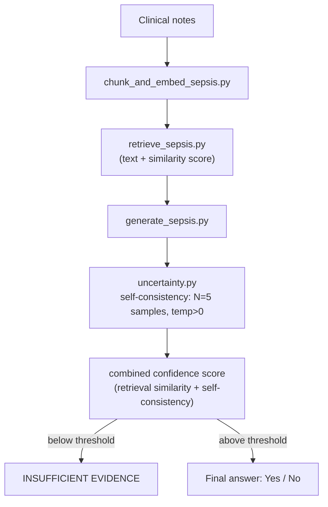
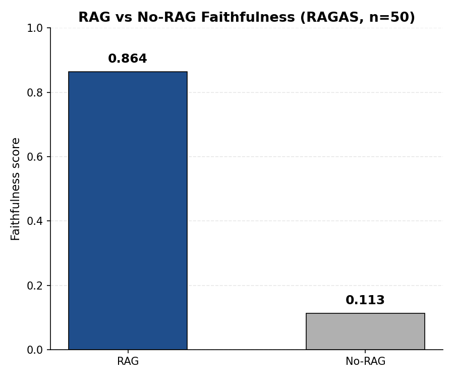

# MedGrounded: Uncertainty-Aware RAG for SEP-1 Sepsis Bundle Compliance

*This is the `feature/sepsis-composer-extension` branch — a portfolio piece extending MedGrounded's biomedical RAG pipeline with an explicit uncertainty layer, built to accompany outreach to Dr. Shamim Nemati's lab (Nemati Lab, UCSD).*

## Purpose

MedGrounded started as a faithfulness benchmark for biomedical RAG (Retrieval-Augmented Generation): given a question and retrieved context, is the generated answer actually supported by that context, or does it subtly misrepresent, exaggerate, or distort the source? The original pipeline measures this on PubMedQA using RAGAS, and compares a RAG answer directly against a **no-RAG baseline** (see [Results](#results) below) — putting a number on how much retrieval actually helps an answer stay grounded, versus the model just generating from pretrained knowledge.

This branch asks a companion question: grounding is necessary but not sufficient — a faithful-sounding answer can still be wrong if the retrieved evidence is thin or the model itself is inconsistent across samples. So instead of only scoring an answer *after* it's generated, this extension adds a layer that decides, *before* committing to an answer, whether the system is confident enough to answer at all.

The target task is **SEP-1** ("Severe Sepsis/Septic Shock Early Management Bundle") **compliance checking from clinical notes** — e.g. "were antibiotics given within 3 hours?" — across 5 core bundle elements. The uncertainty layer is inspired by [COMPOSER (Boussina et al., *npj Digital Medicine*, 2024)](https://doi.org/10.1038/s41746-023-00986-6) from Dr. Shamim Nemati's lab at UCSD, which uses conformal prediction so a sepsis prediction model can flag a case as **indeterminate** instead of forcing a low-confidence guess — cutting false alarms by ~75% versus its predecessor. This project does not implement conformal prediction itself (that needs a formal calibration set this project doesn't have); it borrows the same "know when you don't know" philosophy and applies it to a RAG question-answering setting: a confidence score combining **retrieval similarity** and **self-consistency across repeated LLM samples**, which gates low-confidence answers to an explicit `INSUFFICIENT EVIDENCE` rather than letting the system guess.

Everything for this extension lives alongside the original PubMedQA/RAGAS pipeline in the same `src/` and `data/` — new files sit next to their PubMedQA counterparts (e.g. `retrieve_sepsis.py` next to `retrieve.py`), and nothing about the original pipeline was modified. See [How to run](#how-to-run--in-order) below for both.

## Architecture



```
MedGrounded/
├── data/
│   ├── raw/
│   │   ├── pubmedqa_labeled.jsonl          # PubMedQA, pulled from HuggingFace
│   │   ├── sepsis_notes_synthetic.jsonl    # Synthetic SEP-1 notes (see below)
│   │   └── sepsis_ground_truth.jsonl       # Ground truth for the synthetic notes
│   └── processed/
│       ├── chunks.jsonl, embeddings.npy, faiss_index/       # PubMedQA (IndexFlatL2)
│       ├── sepsis_chunks.jsonl, sepsis_embeddings.npy,
│       │   sepsis_faiss_index/                              # Sepsis notes (IndexFlatIP, cosine)
│       ├── eval_results.jsonl                                # RAG vs no-RAG faithfulness (RAGAS)
│       └── sepsis_eval_results.jsonl, sepsis_eval_summary.jsonl  # SEP-1 accuracy by confidence bucket
├── src/
│   ├── retrieval/
│   │   ├── load_data.py, chunk_and_embed.py, retrieve.py           # PubMedQA (unmodified)
│   │   ├── generate_sepsis_notes.py    # Synthetic SEP-1 notes + ground truth
│   │   ├── chunk_and_embed_sepsis.py   # Chunk + embed notes, cosine FAISS index
│   │   └── retrieve_sepsis.py          # Per-patient scoped retrieval + similarity score
│   ├── generation/
│   │   ├── generate.py           # PubMedQA RAG answer generation (unmodified)
│   │   └── generate_sepsis.py    # SEP-1 question answering, structured JSON output
│   └── eval/
│       ├── evaluate_faithfulness.py, plot_results.py   # RAGAS faithfulness (unmodified)
│       ├── uncertainty.py        # Core of this extension — see below
│       └── evaluate_sepsis.py    # Full pipeline + accuracy-by-confidence-bucket
├── .env                      # API keys (not committed)
├── .env.example               # Template of required environment variables
└── requirements.txt
```

- **`data/`**: `raw/` holds source data (PubMedQA from HuggingFace; the sepsis notes are synthetic — see [Technical challenges](#technical-challenges)). `processed/` holds everything each pipeline generates.
- **`src/retrieval/`**: chunking, embedding, indexing, and search for both tasks. The sepsis files are new, parallel modules next to their PubMedQA counterparts — `retrieve.py` gained one new function, `search()`, added alongside the existing `retrieve()` (which is untouched) so it can return a cosine similarity in `[0, 1]` instead of a raw L2 distance; `retrieve_sepsis.py` calls that new function and scopes results to a single patient's notes.
- **`src/generation/`**: `generate_sepsis.py` mirrors `generate.py`'s "don't guess" rule (answer `INSUFFICIENT EVIDENCE` when context doesn't support an answer) but for the 5 SEP-1 bundle questions, with structured `{"answer": ..., "justification": ...}` JSON output instead of free text, and per-call temperature (needed for self-consistency sampling below).
- **`src/eval/uncertainty.py`** — **the core of this extension**: combines retrieval confidence (top similarity score) with self-consistency (agreement rate across 5 repeated, temperature>0 samples of the same question) into one confidence score, and force-overrides the final answer to `INSUFFICIENT EVIDENCE` when that score falls below a threshold, regardless of what generation produced.
- **`src/eval/evaluate_sepsis.py`**: runs the full pipeline over every (patient, SEP-1 question) pair, scores against ground truth, and buckets results into Low/Medium/High confidence to check that confidence tracks accuracy.

## Environment setup

### Option A — Docker (recommended for quick testing, no local Python setup needed)

```bash
# 1. Build the image
docker build -t medgrounded:v1 .

# 2. Create .env from the template and fill in your API key
cp .env.example .env

# 3. Run the container, mounting data/ and .env
docker run -it --env-file .env -v "$(pwd)/data:/app/data" medgrounded:v1
```

### Option B — venv (recommended if you want to modify the code)

```bash
# 1. Create a virtual environment
python -m venv venv
source venv/bin/activate      # macOS/Linux

# 2. Install dependencies
pip install -r requirements.txt

# 3. Create .env from the template and fill in your API key
cp .env.example .env
```

In `.env`, the required variable is:

```
ANTHROPIC_API_KEY=sk-ant-...
```

(`OPENAI_API_KEY`, `VECTOR_DB_URL`, etc. in `.env.example` are not used by the current pipeline and can be left blank.)

## How to run — in order

### SEP-1 uncertainty-aware pipeline

All commands run from the `MedGrounded/` root with the venv activated.

#### Step 1 — Generate synthetic SEP-1 notes + ground truth

```bash
python src/retrieval/generate_sepsis_notes.py
```

Writes 5 hand-written, fake clinical notes (**not** real patient data — see [Technical challenges](#technical-challenges) for why) to `data/raw/sepsis_notes_synthetic.jsonl`, plus ground truth answers for all 5 SEP-1 questions per note to `data/raw/sepsis_ground_truth.jsonl`.

#### Step 2 — Chunk + embed + build index

```bash
python src/retrieval/chunk_and_embed_sepsis.py
```

Same chunking parameters as PubMedQA's pipeline (~500 chars, 50-char overlap), embedded with `all-MiniLM-L6-v2`. Unlike PubMedQA's `IndexFlatL2`, this builds a cosine-similarity index (`IndexFlatIP` over L2-normalized embeddings) so retrieval returns a similarity score in `[0, 1]`. Output: `data/processed/sepsis_chunks.jsonl`, `sepsis_embeddings.npy`, `sepsis_faiss_index/index.faiss`.

#### Step 3 — Sanity-check retrieval (optional)

```bash
python src/retrieval/retrieve_sepsis.py
```

Runs `retrieve_sepsis()` for one patient and prints the top matching chunks with similarity scores.

#### Step 4 — Sanity-check generation (optional)

```bash
python src/generation/generate_sepsis.py
```

Runs `generate_sepsis_answer()` against a fabricated context and prints the structured `{"answer", "justification"}` result.

#### Step 5 — Evaluate: full pipeline + confidence-bucketed accuracy

```bash
python src/eval/evaluate_sepsis.py
```

For every (patient, SEP-1 question) pair: retrieves context, runs 5-sample self-consistency generation, computes the combined confidence score, applies the low-confidence gate, and compares the final answer to ground truth. Prints an accuracy table by confidence bucket. Output: `data/processed/sepsis_eval_results.jsonl` (detailed) and `sepsis_eval_summary.jsonl` (bucketed).

### Original PubMedQA faithfulness pipeline

This still runs exactly as before — nothing below was changed by this branch.

```bash
python src/retrieval/load_data.py            # Step 1 — load PubMedQA
python src/retrieval/chunk_and_embed.py       # Step 2 — chunk + embed + build index
python src/retrieval/retrieve.py              # Step 3 — sanity-check retrieval (optional)
python src/generation/generate.py             # Step 4 — sanity-check generation (optional)
python src/eval/evaluate_faithfulness.py      # Step 5 — RAG vs no-RAG faithfulness (RAGAS)
```

See [Results](#results) below for what Step 5 produces.

## Results

### SEP-1 accuracy by confidence bucket

Run on the 5 synthetic notes × 5 SEP-1 questions (25 question-answer pairs; each answered with 5-sample self-consistency).

> **Demo/placeholder results.** The synthetic notes only exist to exercise the pipeline's logic end-to-end — these numbers are not clinically meaningful. Real accuracy/coverage numbers will replace this table once MIMIC-IV-Note credentialed access is approved (see [Technical challenges](#technical-challenges)).

| Confidence bucket | n | Accuracy | INSUFFICIENT EVIDENCE rate |
|---|---|---|---|
| Low | 0 | n/a | n/a |
| Medium | 8 | 87.50% | 75.00% |
| High | 17 | 100.00% | 17.65% |
| **Overall** | **25** | **96.00%** | — |

Even on this tiny synthetic set, the intended pattern holds: the High-confidence bucket is both more accurate *and* flags `INSUFFICIENT EVIDENCE` far less often than the Medium bucket — confidence tracks correctness, and the system reaches for "I don't know" specifically where it's more likely to be wrong.

### PubMedQA: RAG vs no-RAG faithfulness (unchanged from the original pipeline)



Run on 50 randomly sampled questions (seed=42) from PubMedQA `pqa_labeled`:

| Group                                                  | Average faithfulness |
| ------------------------------------------------------ | -------------------- |
| **RAG** (with context)                           | **0.864**      |
| **No-RAG** (no context, internal knowledge only) | **0.113**      |
| **Difference (RAG − No-RAG)**                   | **+0.750**     |

RAG answers stay closely grounded in the retrieved evidence (0.864/1.0), while answers generated without context barely align with that same evidence set (0.113) — even when they sound reasonable as general medical knowledge. This quantifies the value of RAG for grounding answers in a specific source, rather than letting the LLM "guess" from pretrained knowledge that can't be verified and easily drifts from the actual reference material.

**How this branch's approach differs**: the table above measures faithfulness *after the fact* — how well a single generated answer matches its context, for every question, regardless of how thin the evidence was. The SEP-1 pipeline adds a decision layer *before* that: retrieval confidence and self-consistency across repeated samples determine whether the system should attempt a specific Yes/No answer at all, or explicitly decline. Faithfulness asks "was this answer grounded?"; this extension asks "should we have answered at all?" — the two are complementary, and a future iteration could apply RAGAS-style faithfulness scoring on top of the SEP-1 answers that do clear the confidence gate.

## Technical challenges

A few non-obvious issues came up while building this, worth knowing if you extend the pipeline:

- **FAISS index choice (PubMedQA)**: `IndexFlatL2` (exact brute-force search) was chosen over approximate indexes like IVF/HNSW. At this scale (~4.5k vectors), brute-force is still fast (milliseconds per query) and gives exact results — approximate indexes only start paying off at millions of vectors.
- **`ragas==0.4.3` vs `langchain-community==0.4.2` incompatibility**: RAGAS unconditionally imports `langchain_community.chat_models.vertexai`, a module that no longer exists in the installed `langchain-community` version (VertexAI isn't even used here). Fixed by registering a stub module in `sys.modules` before importing RAGAS.
- **RAGAS 0.4.x API rewrite**: the familiar `ragas.metrics.Faithfulness` + `LangchainLLMWrapper` pattern from older tutorials is deprecated. The current API lives in `ragas.metrics.collections.Faithfulness` + `ragas.llms.llm_factory`, built around a raw provider SDK client (`AsyncAnthropic`) instead of a LangChain wrapper.
- **`claude-haiku-4-5` rejects `temperature` + `top_p` together**: RAGAS's `llm_factory` sets both by default, which this model's API rejects. Fixed by deleting `top_p` from the LLM's config dict after creation.
- **Segfault from concurrent embedding calls**: an early design ran `retrieve()` (which calls `SentenceTransformer.encode()`) concurrently across threads via `asyncio.to_thread`, which segfaulted — the underlying tokenizers/PyTorch internals aren't safe to call from multiple OS threads at once. Fixed by resolving all retrieval sequentially up front (it's local/CPU-only and fast) and only parallelizing the actual network-bound LLM calls.
- **Hang from mixing sync and async calls on the same client**: reusing the synchronous `generate_answer()` inside a thread pool while also making native async calls (`ainvoke`) on the *same* `ChatAnthropic` client instance corrupted its shared connection pool, causing an indefinite hang (all connections stuck in `CLOSE_WAIT`, ~300% CPU, no progress). Fixed by using `ainvoke()`/`ascore()` exclusively throughout the concurrent evaluation path — never mixing sync `.invoke()` with async calls on the same client.
- **No real sepsis notes yet**: MIMIC-III Clinical Database Demo does *not* work for this — its `NOTEEVENTS` table has been stripped of all row data in the public demo release (verified directly against `NOTEEVENTS.csv` on PhysioNet: the file is 95 bytes, header only, no note text, removed for privacy when MIT built the public demo). MIMIC-IV (without "-Note") also doesn't help — it's structured/tabular data only, no free text. Free-text clinical notes live in the separate **MIMIC-IV-Note** project on PhysioNet, which needs its own credentialed access approval. Until that's granted, `generate_sepsis_notes.py` writes 5 hand-written, fake notes (not real patient data) that deliberately mix clear cases with sparse/ambiguous ones, so the pipeline's `INSUFFICIENT EVIDENCE` flagging can be exercised meaningfully even on fake data. Swapping in real MIMIC-IV-Note data later only means replacing `data/raw/sepsis_notes_synthetic.jsonl` and `data/raw/sepsis_ground_truth.jsonl` with real extracts in the same schema — no code changes needed downstream.
- **Cosine similarity instead of L2 distance for the sepsis index**: `retrieve()`'s existing raw L2 distance isn't a bounded, comparable confidence signal. Rather than change `retrieve()`'s return contract (which `evaluate_faithfulness.py` depends on), the sepsis pipeline builds a *separate* index (`IndexFlatIP` over L2-normalized embeddings) and a new, parameterized `search()` function was added alongside `retrieve()` in the same file. This keeps the PubMedQA path byte-for-byte unchanged while giving the sepsis path a genuine `[0, 1]` similarity score to feed into `uncertainty.py`.
- **Self-consistency needs `temperature > 0`**: at `temperature=0`, repeated calls to `generate_sepsis_answer()` for the same question would be identical every time, making the "agreement rate" trivially 100% and useless as an uncertainty signal. `generate_sepsis.py` applies temperature per call via `.bind()` on a shared `ChatAnthropic` instance rather than the fixed-temperature instance pattern `generate.py` uses, so `uncertainty.py` can sample at `temperature=0.7` for the self-consistency check.
- **Retrieval scoped per patient, not globally**: SEP-1 questions must be answered from one patient's own note, not the nearest match across every patient in the corpus. `retrieve_sepsis()` handles this by retrieving every candidate from the shared FAISS index and filtering by `subject_id`/`hadm_id` — reasonable at this corpus's tiny scale (a handful of synthetic notes), but at real MIMIC-IV-Note scale, per-patient indexing or FAISS metadata pre-filtering would be worth switching to instead.

## License

MIT
