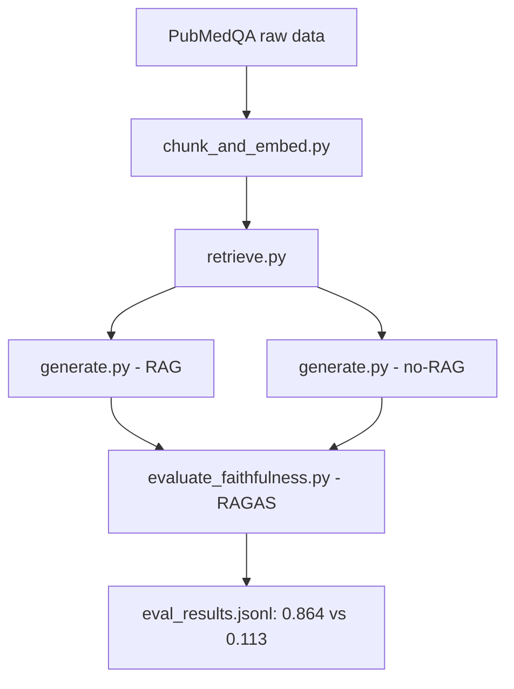

# MedGrounded: Faithfulness & Uncertainty-Aware RAG for Biomedical Text

*This is the `feature/sepsis-composer-extension` branch — a portfolio piece extending MedGrounded's faithfulness-focused RAG pipeline to a new, related question: can a RAG system also tell when it doesn't know, instead of just how well-grounded its guess is? It's built to accompany outreach to Dr. Shamim Nemati's lab (Nemati Lab, UCSD).*

## Purpose

MedGrounded's core pipeline (described below) measures and helps mitigate "hallucination-spin" in RAG (Retrieval-Augmented Generation) systems applied to biomedical text — cases where a generated answer still stays anchored to the retrieved context, but subtly misrepresents, exaggerates, or distorts the certainty or clinical meaning conveyed by the source. It builds a complete RAG pipeline on the PubMedQA dataset, then uses RAGAS to **measure faithfulness** (whether an answer is fully supported by its context) and compares it directly against a **no-RAG baseline** (the LLM answering from its own internal knowledge, with no context at all) — putting a number on how much RAG actually helps an answer stay grounded in real medical evidence, compared to generating without retrieval.

This branch asks a companion question: grounding is necessary but not sufficient — a faithful-sounding answer can still be wrong if the retrieved evidence is thin or the model itself is inconsistent. [`sepsis_extension/`](sepsis_extension/) applies the same faithfulness-first philosophy to a new task, **SEP-1 sepsis bundle compliance checking from clinical notes**, and adds an explicit uncertainty layer on top: a confidence score combining retrieval similarity and self-consistency across repeated LLM samples, which gates low-confidence answers to an explicit `INSUFFICIENT EVIDENCE` rather than letting the system guess. The approach is inspired by [COMPOSER (Boussina et al., *npj Digital Medicine* 2024)](https://www.nature.com/articles/s41746-024-01029-2), which uses conformal prediction so a sepsis prediction model can flag a case as indeterminate instead of forcing a low-confidence guess — cutting false alarms by ~75% versus its predecessor. `sepsis_extension` doesn't implement conformal prediction itself (that needs a formal calibration set this project doesn't have), but borrows the same "know when you don't know" philosophy in a RAG QA setting. See [`sepsis_extension/README.md`](sepsis_extension/README.md) for the full design and how to run it.

The sections below describe MedGrounded's original PubMedQA/RAGAS pipeline, which `sepsis_extension` builds on but does not modify.

## Architecture



```
MedGrounded/
├── data/
│   ├── raw/                  # Raw dataset pulled from HuggingFace, unprocessed
│   └── processed/            # Chunks, embeddings, FAISS index, eval results
├── src/
│   ├── retrieval/            # Load data, chunk + embed, build FAISS index, retrieve
│   ├── generation/           # Generate context-grounded answers (RAG) via Claude
│   └── eval/                 # Measure faithfulness with RAGAS, compare RAG vs no-RAG
├── .env                      # API keys (not committed)
├── .env.example               # Template of required environment variables
└── requirements.txt
```

- **`data/`**: holds all intermediate data and outputs. `raw/` is the dataset exactly as pulled from HuggingFace; `processed/` is everything the pipeline generates (chunks, vector embeddings, the FAISS index, final evaluation results).
- **`src/retrieval/`**: the "find the evidence" half of the pipeline — loading the dataset, chunking text, generating embeddings, building an index for semantic search, and the shared `retrieve()` function used by every step downstream.
- **`src/generation/`**: the "write the answer" half — merges retrieved context into a prompt and calls Claude to answer, constrained to only use that context (no making things up).
- **`src/eval/`**: the "score it" half — uses RAGAS to measure faithfulness for both the RAG answer and the no-RAG baseline answer, running concurrently for speed.

## Environment setup

### Option A — Docker (recommended for quick testing, no local Python setup needed)

```bash
# 1. Build the image
docker build -t medgrounded:v1 .

# 2. Create .env from the template and fill in your API key
cp .env.example .env

# 3. Run the container, mounting data/ and .env
docker run -it --env-file .env -v "$(pwd)/data:/app/data" medgrounded:v1
```

### Option B — venv (recommended if you want to modify the code)

```bash
# 1. Create a virtual environment
python -m venv venv
source venv/bin/activate      # macOS/Linux

# 2. Install dependencies
pip install -r requirements.txt

# 3. Create .env from the template and fill in your API key
cp .env.example .env
```

In `.env`, the required variable is:

```
ANTHROPIC_API_KEY=sk-ant-...
```

(`OPENAI_API_KEY`, `VECTOR_DB_URL`, etc. in `.env.example` are not used by the current pipeline and can be left blank.)

## How to run — in order

Each step consumes the output of the previous one, so run them sequentially the first time. All commands run from the `MedGrounded/` root with the venv activated.

### Step 1 — Load the dataset

```bash
python src/retrieval/load_data.py
```

Downloads PubMedQA (config `pqa_labeled`, 1000 samples with yes/no/maybe labels) from HuggingFace, prints the sample count plus one example for a sanity check, and saves it to `data/raw/pubmedqa_labeled.jsonl`.

### Step 2 — Chunk + embed + build index

```bash
python src/retrieval/chunk_and_embed.py
```

Reads `pubmedqa_labeled.jsonl`, splits each context into ~500-character chunks (50-character overlap), embeds them with `all-MiniLM-L6-v2`, and builds a FAISS index (`IndexFlatL2`). Output: `data/processed/chunks.jsonl`, `embeddings.npy`, `faiss_index/index.faiss`.

### Step 3 — Sanity-check retrieval (optional)

```bash
python src/retrieval/retrieve.py
```

Runs `retrieve()` against a few sample questions and prints the top-5 nearest chunks, to confirm retrieval behaves sensibly before moving on.

### Step 4 — Sanity-check generation (optional)

```bash
python src/generation/generate.py
```

Runs `generate_answer()`: retrieves context, calls Claude to generate a grounded answer, and prints the result — including the "insufficient evidence" case when the context isn't enough to answer.

### Step 5 — Evaluate faithfulness (RAG vs no-RAG)

```bash
python src/eval/evaluate_faithfulness.py
```

Takes 50 fixed questions (seed=42) from the dataset. For each one: generates both a RAG answer and a no-RAG answer, scores faithfulness for both with RAGAS (judge model `claude-haiku-4-5`), running up to 5 questions concurrently. Output: `data/processed/eval_results.jsonl`, plus printed per-group averages and the difference.

## Results


Run on 50 randomly sampled questions (seed=42) from PubMedQA `pqa_labeled`:

| Group                                                  | Average faithfulness |
| ------------------------------------------------------ | -------------------- |
| **RAG** (with context)                           | **0.864**      |
| **No-RAG** (no context, internal knowledge only) | **0.113**      |
| **Difference (RAG − No-RAG)**                   | **+0.750**     |

RAG answers stay closely grounded in the retrieved evidence (0.864/1.0), while answers generated without context barely align with that same evidence set (0.113) — even when they sound reasonable as general medical knowledge. This quantifies the value of RAG for grounding answers in a specific source, rather than letting the LLM "guess" from pretrained knowledge that can't be verified and easily drifts from the actual reference material.

## Technical challenges

A few non-obvious issues came up while building this, worth knowing if you extend the pipeline:

- **FAISS index choice**: `IndexFlatL2` (exact brute-force search) was chosen over approximate indexes like IVF/HNSW. At this scale (~4.5k vectors), brute-force is still fast (milliseconds per query) and gives exact results — approximate indexes only start paying off at millions of vectors.
- **`ragas==0.4.3` vs `langchain-community==0.4.2` incompatibility**: RAGAS unconditionally imports `langchain_community.chat_models.vertexai`, a module that no longer exists in the installed `langchain-community` version (VertexAI isn't even used here). Fixed by registering a stub module in `sys.modules` before importing RAGAS.
- **RAGAS 0.4.x API rewrite**: the familiar `ragas.metrics.Faithfulness` + `LangchainLLMWrapper` pattern from older tutorials is deprecated. The current API lives in `ragas.metrics.collections.Faithfulness` + `ragas.llms.llm_factory`, built around a raw provider SDK client (`AsyncAnthropic`) instead of a LangChain wrapper.
- **`claude-haiku-4-5` rejects `temperature` + `top_p` together**: RAGAS's `llm_factory` sets both by default, which this model's API rejects. Fixed by deleting `top_p` from the LLM's config dict after creation.
- **Segfault from concurrent embedding calls**: an early design ran `retrieve()` (which calls `SentenceTransformer.encode()`) concurrently across threads via `asyncio.to_thread`, which segfaulted — the underlying tokenizers/PyTorch internals aren't safe to call from multiple OS threads at once. Fixed by resolving all retrieval sequentially up front (it's local/CPU-only and fast) and only parallelizing the actual network-bound LLM calls.
- **Hang from mixing sync and async calls on the same client**: reusing the synchronous `generate_answer()` inside a thread pool while also making native async calls (`ainvoke`) on the *same* `ChatAnthropic` client instance corrupted its shared connection pool, causing an indefinite hang (all connections stuck in `CLOSE_WAIT`, ~300% CPU, no progress). Fixed by using `ainvoke()`/`ascore()` exclusively throughout the concurrent evaluation path — never mixing sync `.invoke()` with async calls on the same client.

## License

MIT
